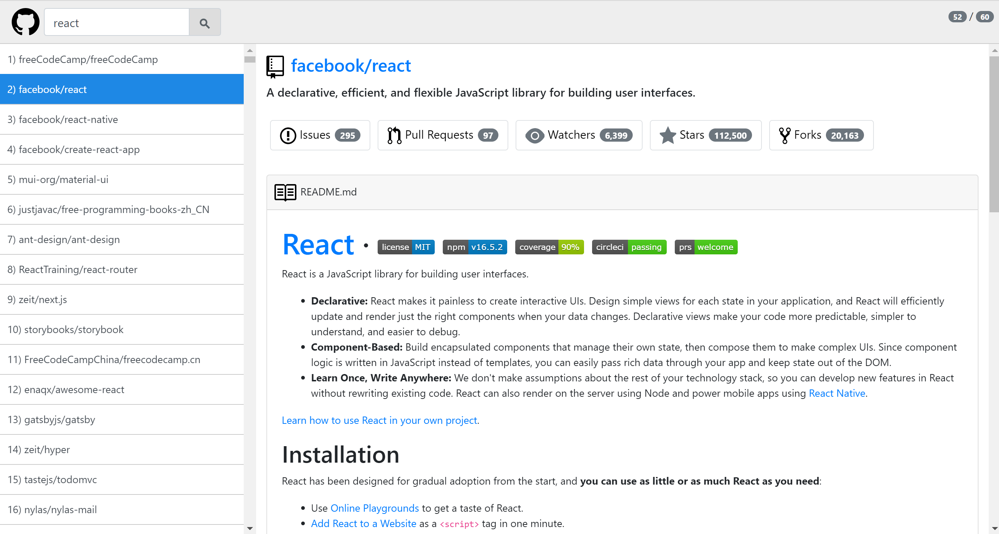

## [githubbrowser](https://github.com/easyTree/githubbrowser)

Sandbox project which interacts with the GitHub API to allow browsing of repositories by name.

[Open githubbrowser now](https://easytree.github.io/githubbrowser)

---
##### Stream of consciousness
  - The results are ordered with the greatest number of stars at the top.
  - The list is lazy-loaded and populates 100 items at a time, in theory without limit.
  - Dragging the scroll thumb around is discouraged *unless you'd like to see an error message* :D - time constraints were not in favour of a graceful solution.
  - Unauthenticated API access is used which implies low usage quotas; the remaining quotas are shown top-right (click for more detail.)
    - The top-right quotas show &lt;quota remaining&gt; / &lt;total quota&gt; for the area which last sent back quota-headers
    - Clicking the top-right quotas shows more information which is correct when opened; because this requires a distinct request be made to the API, it's necessary to press the Refresh button to get the latest.
    - In contrast, the top-right quotas are always up-to-date as these figures are gathered passively
    - Running out of API credits prevents the Issues, Pull Requests, Watchers and README from loading

---

##### Repository stats
  - Issues
  - Pull Requests
  - Watchers
  - Stars
  - Forks

are clickable; they, as well as the repository-name header and all links within the README.md open in new browser tabs.

